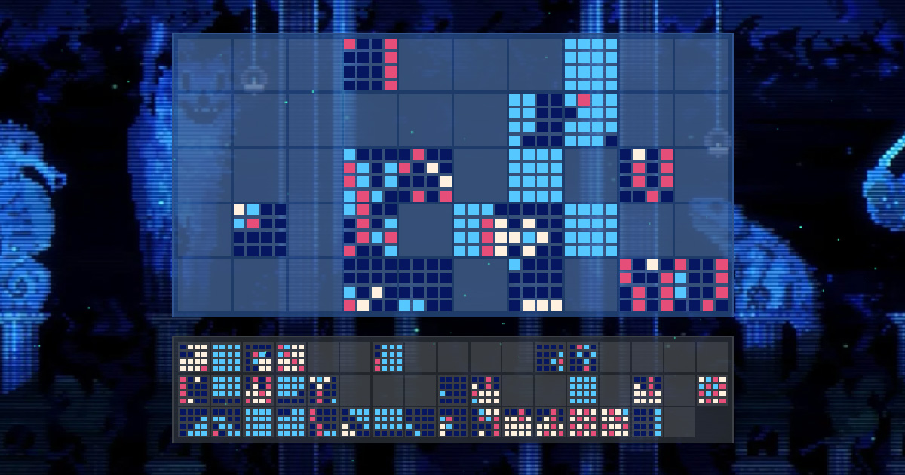

# Animal Well: Bunny Mural Puzzle Helper

## Overview

The [Bunny Mural Puzzle Helper](https://philippgitpush.github.io/bunnymuralhelper/) is a tool designed to assist players in solving the Bunny Mural Puzzle in [Animal Well](https://store.steampowered.com/app/813230/ANIMAL_WELL/). It simplifies the process of piecing together the mural by providing a canvas where everyone can stitch together the final solution.

## Planned

- **Position Storage:** Thinking of storing the position data for the tiles in the users session cookie, it should do the trick for now.
- **Stitching Assistants:** As suggested by @mvp__ from the BIGMODE Official Discord Server: Adding coloring for the position indicators to show correctly / wrongly placed tiles / pieces.

## License

This project is licensed under the MIT License - see the [LICENSE](LICENSE) file for details.

## Acknowledgements

Special thanks to the community members of Animal Well for their contributions and cooperation in solving the Bunny Mural puzzle, and to [Andrew Stretch](https://techraptor.net/gaming/guides/animal-well-bunny-mural-guide) for providing a great guide.

Thanks to [@Silverfeelin](https://github.com/Silverfeelin) for suggesting a more robust way of dragging objects for better browser support!

Some assets such as images and sounds are subject to the copyright of [Billy Basso](https://twitter.com/billy_basso?lang=de).
